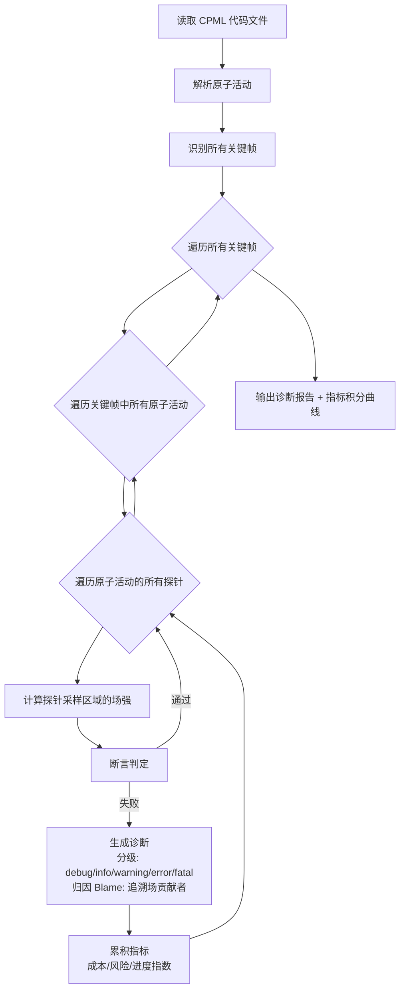

# CPML 工作流程

## 编译与诊断管线

## 关键设计决策

**按需计算：** 场强计算仅在探针采样范围内执行（而非对全场景做全局仿真），避免不必要计算。每个探针声明其关注的空间范围和场维度，编译器只计算这些区域的场叠加结果。

**Blame 机制：** 探针告警时，编译器回溯场强的所有贡献投影，输出贡献者列表（哪个活动的哪个投影、贡献比例），支撑施工方案的根因分析。

**指标积分：** 每个关键帧的诊断按分级规则累加到指标（成本偏差、风险指数、工期影响等），输出时间序列，形成方案的可量化比较基准。
